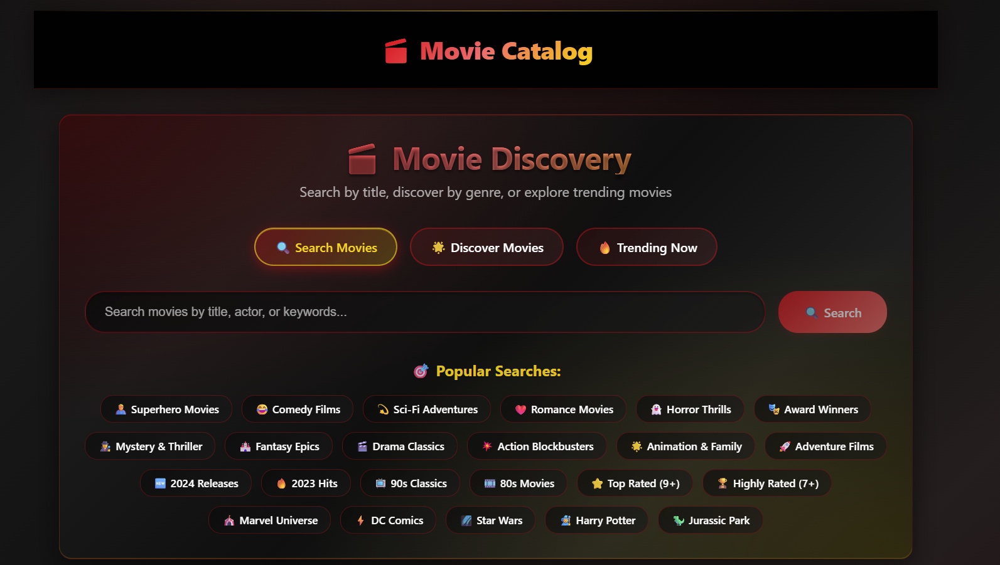

# 🎬 Movie Catalog

A modern Vue 3 movie discovery app powered by The Movie Database (TMDB) API.

## 🌐 Live Demo

🚀 **Production:** [View Live App](https://liba-movie-database.netlify.app/) *(Coming Soon)*

## ✨ Features

- 🔍 **Search Movies** - Find movies by title, cast, or keywords
- 🎭 **Browse Genres** - Explore movies by your favorite genres  
- 📅 **Filter by Year** - Discover films from any era
- ⭐ **Rating Filter** - Find highly-rated gems
- 📈 **Trending Movies** - See what's popular now
- 🎬 **Detailed Info** - Get comprehensive movie details

## 🛠️ Tech Stack

- **Vue 3** + TypeScript
- **Pinia** for state management
- **Vue Router** for navigation
- **TMDB API** for movie data
- **CSS Variables** for theming
- **Vite** for build tooling

## 🚀 Quick Start

1. **Clone the repository**
   ```bash
   git clone https://github.com/yourusername/movie-catalog.git
   cd movie-catalog
   ```

2. **Install dependencies**
   ```bash
   npm install
   ```

3. **Set up environment variables**
   
   Create a `.env` file in the root directory:
   ```env
   VITE_TMDB_ACCESS_TOKEN=your_tmdb_access_token_here
   ```
   
   Get your TMDB API key from [The Movie Database](https://www.themoviedb.org/settings/api)

4. **Start development server**
   ```bash
   npm run dev
   ```

5. **Build for production**
   ```bash
   npm run build
   ```

## 📱 Screenshots

### 🏠 Home Page - Search & Discovery

*Search movies, browse trending content, and use quick suggestions*

## 🤝 Contributing

Contributions are welcome! Please feel free to submit a Pull Request.

## 📄 License

This project is licensed under the MIT License.

---

Made with ❤️ and Vue 3
